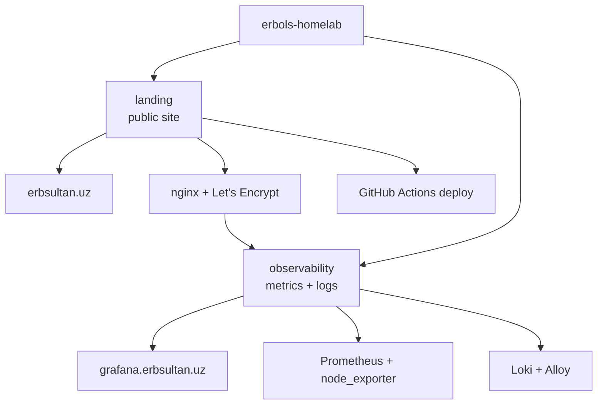

# erbols-homelab

✨ A growing homelab monorepo where I build real DevOps projects instead of
only watching courses.

Right now it runs a public personal site, a hardened VPS, automated deploys,
metrics, and log collection.

> Russian version: [README_rus.md](./README_rus.md)

## Status

| Area | State |
|------|-------|
| 🌐 Public site | ✅ [`erbsultan.uz`](https://erbsultan.uz) |
| 📊 Observability UI | ✅ [`grafana.erbsultan.uz`](https://grafana.erbsultan.uz) |
| 🛡️ VPS hardening | ✅ key-only SSH, `ufw`, `fail2ban`, unattended upgrades |
| 🚀 Deploy | ✅ GitHub Actions + `rsync` + Telegram status |
| 📈 Metrics | ✅ Prometheus + node_exporter |
| 🪵 Logs | ✅ Loki + Alloy collecting nginx logs |
| 🚨 Alerts | ✅ Grafana Alerting sends to Telegram |

## Map



## Projects

| Project | What it does | Status |
|---------|--------------|--------|
| [`landing/`](./landing) | Public front door and personal DevOps profile at [`erbsultan.uz`](https://erbsultan.uz) | ✅ Live |
| [`observability/`](./observability) | Grafana, Prometheus, node_exporter, Loki, and Alloy for VPS metrics and nginx logs | ✅ Live |

## Public Endpoints

| URL | Purpose |
|-----|---------|
| [`https://erbsultan.uz`](https://erbsultan.uz) | Personal landing page |
| [`https://grafana.erbsultan.uz`](https://grafana.erbsultan.uz) | Grafana dashboards and Explore UI |

Prometheus, Loki, Alloy UI, and node_exporter are intentionally private.
Grafana is the only public observability entrypoint.

## Stack

| Layer | Tools |
|-------|-------|
| Cloud | Vultr Cloud Compute, Frankfurt |
| OS | Ubuntu 24.04 LTS |
| Web | nginx, Let's Encrypt, certbot |
| Deploy | GitHub Actions, SSH, rsync |
| Security | ufw, fail2ban, key-only SSH |
| Metrics | Prometheus, node_exporter, Grafana |
| Logs | Loki, Alloy, Grafana Explore |
| DNS | eskiz.uz, Duck DNS fallback |

## Repository Layout

```text
erbols-homelab/
├── landing/          # public website and VPS bootstrap docs
├── observability/    # Grafana, Prometheus, Loki, Alloy
├── .github/          # deploy workflow
├── README.md
└── README_rus.md
```

Each project has its own README with screenshots, architecture, checks, and
rebuild notes.

## Next

- 📬 Optionally add email as a second alert contact point
- 🔐 Add an OpenVPN project for private homelab access
- 🧪 Add smoke checks for public URLs
