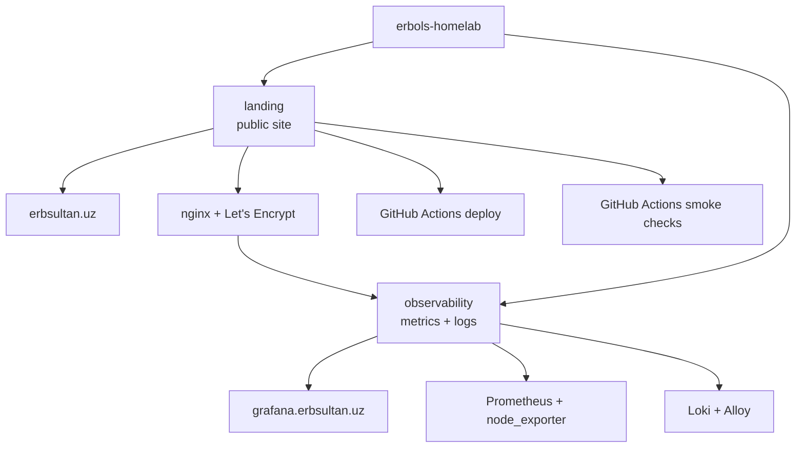
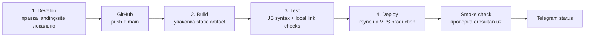

# erbols-homelab

✨ Растущий homelab-монорепозиторий, где я строю реальные DevOps-проекты,
а не только смотрю курсы.

Сейчас здесь уже есть публичный personal site, hardened VPS, автоматический
деплой, метрики и сбор логов.

> English version: [README.md](./README.md)

## Статус

| Область | Состояние |
|---------|-----------|
| 🌐 Публичный сайт | ✅ [`erbsultan.uz`](https://erbsultan.uz) |
| 📊 Observability UI | ✅ [`grafana.erbsultan.uz`](https://grafana.erbsultan.uz) |
| 🛡️ VPS hardening | ✅ key-only SSH, `ufw`, `fail2ban`, unattended upgrades |
| 🚀 Deploy | ✅ GitHub Actions + `rsync` + Telegram status |
| 📈 Метрики | ✅ Prometheus + node_exporter |
| 🪵 Логи | ✅ Loki + Alloy собирают nginx-логи |
| 🚨 Alerts | ✅ Grafana Alerting отправляет в Telegram |
| 🧪 Smoke checks | ✅ GitHub Actions проверяет публичные URL каждую минуту |

## Карта



## Проекты

| Проект | Что делает | Статус |
|--------|------------|--------|
| [`landing/`](./landing) | Публичная входная точка и personal DevOps profile на [`erbsultan.uz`](https://erbsultan.uz) | ✅ Live |
| [`observability/`](./observability) | Grafana, Prometheus, node_exporter, Loki и Alloy для метрик VPS и nginx-логов | ✅ Live |

## Публичные Адреса

| URL | Зачем |
|-----|------|
| [`https://erbsultan.uz`](https://erbsultan.uz) | Personal landing page |
| [`https://grafana.erbsultan.uz`](https://grafana.erbsultan.uz) | Grafana dashboards и Explore UI |

Prometheus, Loki, Alloy UI и node_exporter намеренно приватные. Grafana —
единственная публичная точка входа в observability.

## Стек

| Слой | Инструменты |
|------|-------------|
| Cloud | Vultr Cloud Compute, Frankfurt |
| OS | Ubuntu 24.04 LTS |
| Web | nginx, Let's Encrypt, certbot |
| Deploy | GitHub Actions, SSH, rsync |
| Security | ufw, fail2ban, key-only SSH |
| Metrics | Prometheus, node_exporter, Grafana |
| Logs | Loki, Alloy, Grafana Explore |
| DNS | eskiz.uz, Duck DNS fallback |

## CI/CD Pipeline

Публичный сайт деплоится по схеме, близкой к маленькому production-сервису:



Workflow лежит в
[`deploy-landing.yml`](./.github/workflows/deploy-landing.yml). Deploy
запускается только после успешных build и test, затем production smoke check
проверяет живой сайт перед финальным уведомлением в Telegram.

## Структура Репозитория

```text
erbols-homelab/
├── landing/          # публичный сайт и VPS bootstrap-документация
├── observability/    # Grafana, Prometheus, Loki, Alloy
├── .github/          # deploy workflow
├── README.md
└── README_rus.md
```

У каждого проекта свой README со скриншотами, архитектурой, проверками и
заметками по воспроизведению.

## Дальше

- 📬 При желании добавить email вторым alert contact point
- 🔐 Добавить OpenVPN-проект для приватного доступа к homelab
- 🧭 Сделать nginx access-log dashboard
