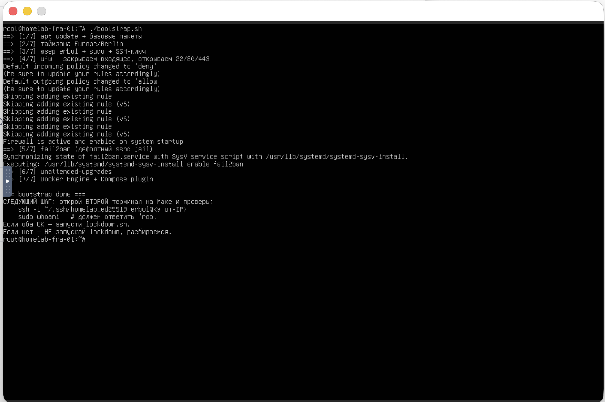
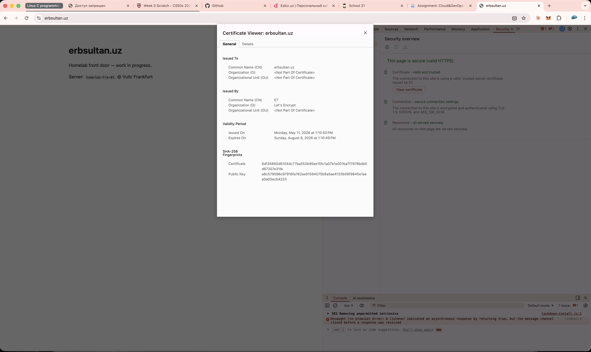

# landing — erbsultan.uz


The public front door of the homelab. Static page on a hardened Ubuntu
24.04 VPS, served over HTTPS at **[erbsultan.uz](https://erbsultan.uz)**.

The page itself is intentionally minimal — the interesting part is what
holds it up.

> Russian version: [README_rus.md](./README_rus.md) · Reference deploy: [PROVISION.md](./PROVISION.md)

## Architecture

```
       eskiz DNS
           │
           │  A erbsultan.uz  →  108.61.211.82
           ▼
   ┌─────────────────────────────────────────┐
   │  Vultr · Frankfurt · homelab-fra-01     │
   │  Ubuntu 24.04 LTS                       │
   │                                         │
   │    ufw      →  22 / 80 / 443 only       │
   │    fail2ban →  watches the sshd jail    │
   │                                         │
   │    nginx :443  ──▶  /var/www/.../html   │
   │                          └ index.html   │
   │                                         │
   │    TLS:  Let's Encrypt (90 d auto-renew)│
   └─────────────────────────────────────────┘
           ▲
           │  HTTPS
           │
       browser
```

## Stack

- **Vultr** Cloud Compute, Frankfurt — `homelab-fra-01`, 2 vCPU / 2 GB / 60 GB
- **Ubuntu 24.04 LTS** — hardened: `ufw`, `fail2ban`, `unattended-upgrades`, key-only SSH
- **Nginx 1.24** — static host, HTTP → HTTPS redirect
- **Let's Encrypt** — `certbot --nginx`, auto-renew via systemd timer
- **eskiz.uz** — DNS for `erbsultan.uz` (A record only, no CDN yet)
- **Duck DNS** — `erbsultan.duckdns.org` kept as a fallback A-record

## Walkthrough

### 1. The box

Small Vultr VPS in Frankfurt. AMD shared CPU, 2 vCPU / 2 GB, IPv4 + IPv6,
SSH key attached at deploy time — so the box never had a root password
to email and leak.


Cheapest tier with IPv4 was enough for now — the rest of the stack doesn't
care, and scaling vertically on Vultr is one toggle.

### 2. The SSH key

A dedicated `ed25519` keypair just for the homelab, separate from the one
that pushes to GitHub. Smaller blast radius if either ever leaks.

```bash
ssh-keygen -t ed25519 -C "homelab@erbsultan" -f ~/.ssh/homelab_ed25519
```

Public half lives in Vultr → Account → SSH Keys *before* the instance
is deployed, so it lands in `/root/.ssh/authorized_keys` automatically.

### 3. Bootstrap

[`bootstrap/bootstrap.sh`](bootstrap/bootstrap.sh) — one shot, run on
first SSH in as root. Creates a non-root sudo user (`erbol`), copies the
key, installs `ufw` / `fail2ban` / `unattended-upgrades` / Docker, and
opens only ports 22 / 80 / 443 on the firewall.



It deliberately doesn't touch root SSH — that's `lockdown.sh`'s job. The
split exists for a reason: if anything's wrong with the new user, you
want root still working as a recovery path.

### 4. Lockdown

Only after verifying — from a **second** terminal — that the new user
logs in cleanly:

```
ssh erbol@<ip>     # connects
sudo whoami        # → root
docker --version   # → Docker version X.Y.Z
```

…I ran [`bootstrap/lockdown.sh`](bootstrap/lockdown.sh) to disable root
SSH and password auth entirely.

One gotcha that bit me: Ubuntu's cloud-init drops
`/etc/ssh/sshd_config.d/50-cloud-init.conf` with `PasswordAuthentication yes`.
Alphabetically `50` < `99`, so it overrides our hardening file (sshd
picks the *first* occurrence of each directive). `lockdown.sh` removes
that cloud-init file before writing its own.

End state:


Before lockdown I also set a password on the `erbol` user with
`sudo passwd erbol`. SSH still only accepts keys — the password is
purely for Vultr's web console, in case I ever lock myself out and
need to recover through the cloud provider's out-of-band channel.

### 5. DNS

`erbsultan.uz` is registered through [eskiz.uz](https://eskiz.uz) and
DNS lives there too — a plain A record to the VPS IP, plus a CNAME for
`www`. No Cloudflare in front for now; that's a future iteration if
wildcard certs or DDoS edge become useful.


`erbsultan.duckdns.org` is also pointed at the same IP via Duck DNS as
a free fallback — a second resolvable name in case eskiz has DNS issues.

### 6. Nginx + Let's Encrypt

Plain HTTP server block first ([`nginx/erbsultan.uz.conf`](nginx/erbsultan.uz.conf)),
listening on `:80` with `server_name erbsultan.uz www.erbsultan.uz`,
rooted at `/var/www/erbsultan.uz/html`. Once `curl -I http://erbsultan.uz`
came back `200 OK`, certbot took over:

```bash
sudo certbot --nginx -d erbsultan.uz -d www.erbsultan.uz
```

HTTP-01 challenge runs through the live nginx (Let's Encrypt fetches
`/.well-known/acme-challenge/...`), and certbot patches the same conf
file in place — adding the `:443` server block, the cert paths, and a
`301 → https` redirect from `:80`.


Cert is from Let's Encrypt, 90-day lifetime. Certbot installs a systemd
timer that runs `certbot renew` twice a day; renewal happens silently
once the cert is past its midpoint.



## Layout

```
landing/
├── bootstrap/
│   ├── bootstrap.sh   # provisioning a fresh Ubuntu 24.04 VPS
│   └── lockdown.sh    # disables root SSH + password auth
├── nginx/
│   └── erbsultan.uz.conf  # server block (certbot adds HTTPS half)
├── site/
│   └── index.html     # the page
└── docs/img/          # walkthrough screenshots
```

Both scripts have a `CONFIG` block at the top with the only values worth
tweaking (`NEW_USER`, `TIMEZONE`) — drop them onto any fresh Ubuntu box,
edit two lines, run.

## Up next

- **GitHub Actions deploy** — push to `main` → rsync `site/` to the box, reload nginx
- **Monitoring stack** — Prometheus + Grafana + node_exporter on `grafana.erbsultan.uz`
- **Cloudflare DNS** (maybe) — delegate NS to CF for wildcard certs and DDoS edge

For exact commands to reproduce this on a fresh box, see [PROVISION.md](./PROVISION.md).
