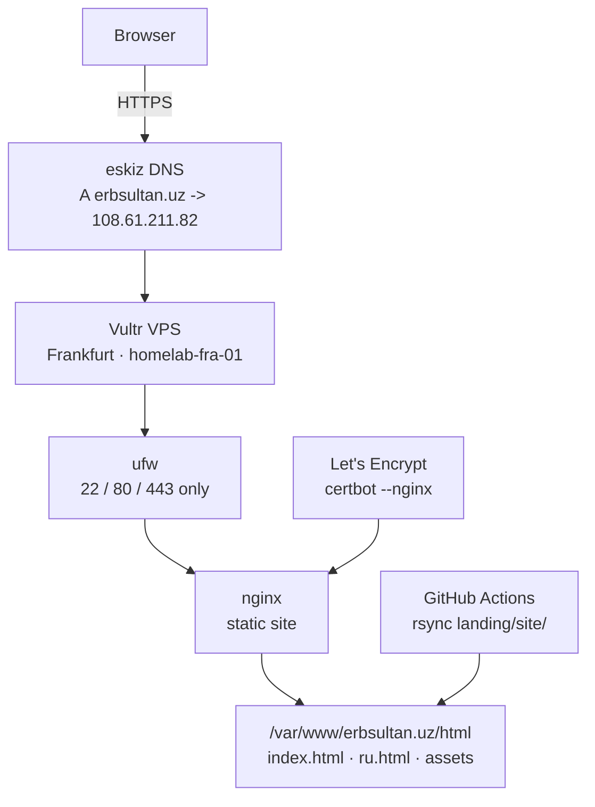

# landing — erbsultan.uz

[](https://github.com/erbsultan/erbols-homelab/actions/workflows/deploy-landing.yml)

✨ The public front door of the homelab: a tiny static personal site,
served from a hardened Ubuntu VPS at
[`erbsultan.uz`](https://erbsultan.uz).

Today the page is a lightweight DevOps profile: EN/RU copy, theme toggle,
dark-mode starfield, profile photo, project links, and contact links.
The first version was intentionally blank; the live site has since grown
into the personal homepage shown at `erbsultan.uz`.

<p>
  
</p>

<p>
  <sub>Early screenshot from the first deploy. The live page now has the personal profile UI described above.</sub>
</p>

> Russian version: [README_rus.md](./README_rus.md) · Reproduce it from scratch: [PROVISION.md](./PROVISION.md)

## Status

| Layer | Tool | State |
|-------|------|-------|
| 🌐 Site | Static HTML/CSS/JS | ✅ Personal DevOps profile live at `https://erbsultan.uz` |
| 🌓 UI | EN/RU, theme toggle, starfield | ✅ Current live version |
| 🔐 TLS | Let's Encrypt | ✅ HTTPS enabled, auto-renew via systemd |
| 🧱 Web server | nginx | ✅ Static host + HTTP to HTTPS redirect |
| 🛡️ Hardening | ufw, fail2ban, key-only SSH | ✅ Root SSH and password auth disabled |
| 🚀 Deploy | GitHub Actions + rsync | ✅ Push to `main` deploys `landing/site/**` |
| 📬 Deploy notifications | GitHub Actions + Telegram | ✅ Sends deploy result to Telegram |
| 📊 Observability | Grafana, Prometheus, Loki, Alloy | ✅ Tracked in [`../observability`](../observability) |

## Architecture



## What Works

- ✅ `erbsultan.uz` resolves through eskiz.uz DNS
- ✅ nginx serves the static site over HTTPS
- ✅ HTTP redirects to HTTPS
- ✅ SSH is key-only; root SSH and password auth are disabled
- ✅ `ufw` allows only SSH, HTTP, and HTTPS
- ✅ `fail2ban` watches SSH
- ✅ GitHub Actions deploys site changes automatically
- ✅ GitHub Actions sends deploy status to Telegram
- ✅ Grafana now watches metrics and nginx logs from the VPS

## Screenshots

<p>
  
  
</p>

<p>
  
  
</p>

<p>
  <sub>VPS, DNS, firewall hardening, and TLS: the boring pieces that make the tiny page real.</sub>
</p>

## Stack

| Piece | Choice |
|-------|--------|
| VPS | Vultr Cloud Compute, Frankfurt, `homelab-fra-01` |
| OS | Ubuntu 24.04 LTS |
| Web server | nginx 1.24 |
| TLS | Let's Encrypt via `certbot --nginx` |
| DNS | eskiz.uz for `erbsultan.uz` |
| Fallback DNS | Duck DNS at `erbsultan.duckdns.org` |
| Firewall | `ufw` |
| SSH protection | `fail2ban`, key-only auth |
| Deploy | GitHub Actions + `rsync` |

## Useful Checks

```bash
curl -I https://erbsultan.uz
sudo nginx -t
sudo ufw status
sudo fail2ban-client status sshd
sudo systemctl list-timers certbot.timer
```

Deploy workflow:

```text
edit landing/site/*
git push origin main
GitHub Actions -> rsync -> /var/www/erbsultan.uz/html
GitHub Actions -> Telegram deploy status message
```

Deploy notifications require these GitHub repository secrets:

```text
TELEGRAM_BOT_TOKEN
TELEGRAM_CHAT_ID
```

## Files

```text
landing/
├── site/
│   ├── index.html        # English page
│   ├── ru.html           # Russian page
│   ├── style.css         # shared styling
│   ├── theme.js          # light/dark/system theme toggle
│   ├── stars.js          # dark-theme starfield
│   └── me.jpg            # profile image
├── bootstrap/
│   ├── bootstrap.sh      # first-touch Ubuntu VPS setup
│   └── lockdown.sh       # disables root SSH + password auth
├── nginx/
│   └── erbsultan.uz.conf # HTTP server block before certbot edits
├── docs/img/             # screenshots
├── PROVISION.md          # exact rebuild steps
└── README.md
```

## Build Log

| Step | Result |
|------|--------|
| VPS | ✅ Vultr Frankfurt instance created with SSH key |
| Bootstrap | ✅ non-root sudo user, Docker, ufw, fail2ban, unattended upgrades |
| Lockdown | ✅ root SSH and password auth disabled |
| DNS | ✅ `erbsultan.uz -> 108.61.211.82` |
| nginx | ✅ static site served from `/var/www/erbsultan.uz/html` |
| TLS | ✅ Let's Encrypt certificate deployed |
| CI/CD | ✅ GitHub Actions deploys `landing/site/**` |
| Notifications | ✅ GitHub Actions sends deploy status to Telegram |
| Monitoring | ✅ moved to the dedicated `observability/` project |

## Next

- 🧭 Keep the landing page minimal and fast
- 🧪 Add a tiny smoke test for the deployed URL
- 🔐 Later: put internal homelab services behind VPN, not behind public DNS

For exact commands to reproduce this on a fresh VPS, see [PROVISION.md](./PROVISION.md).
