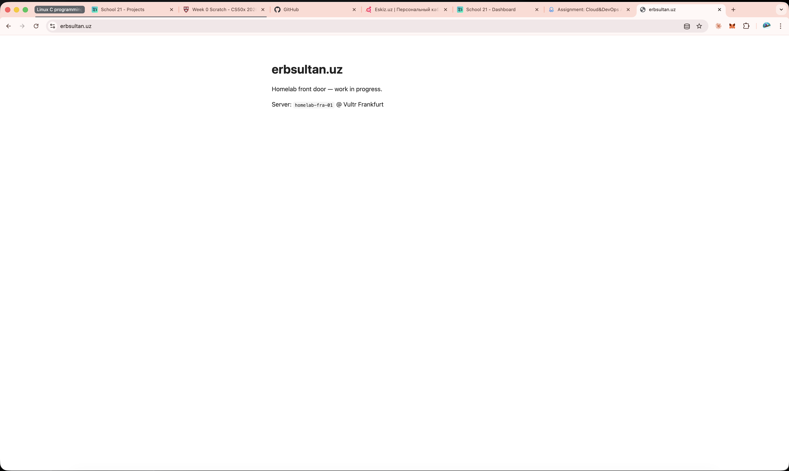
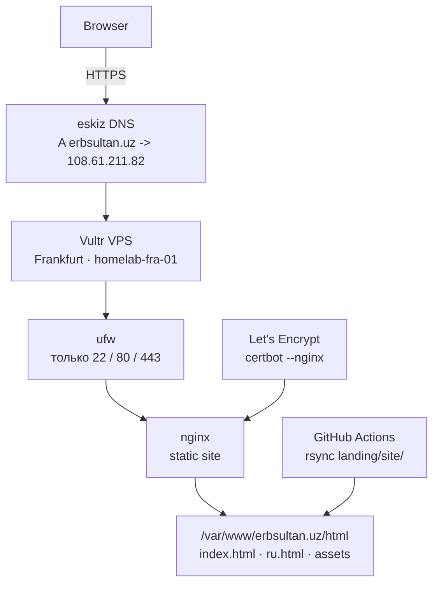
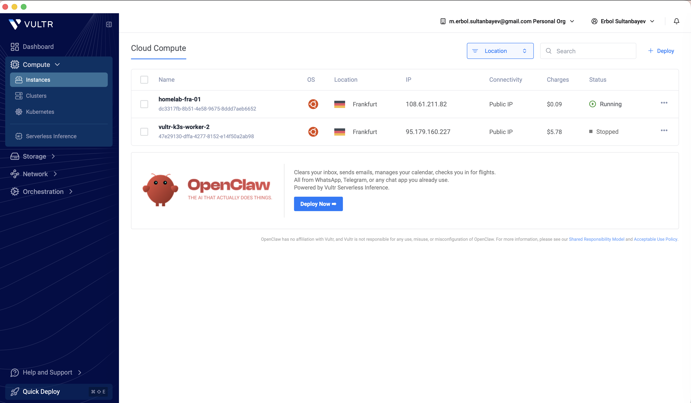
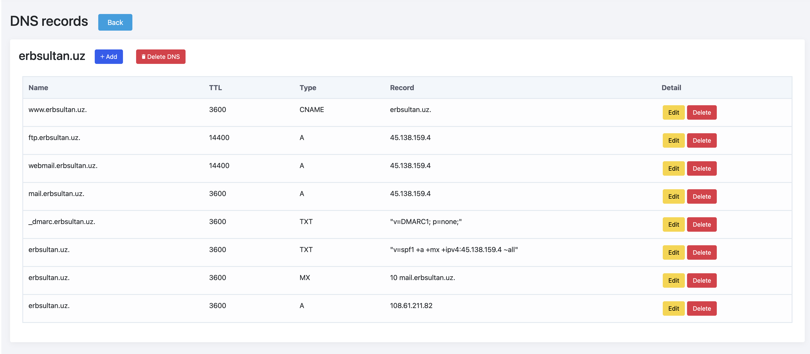
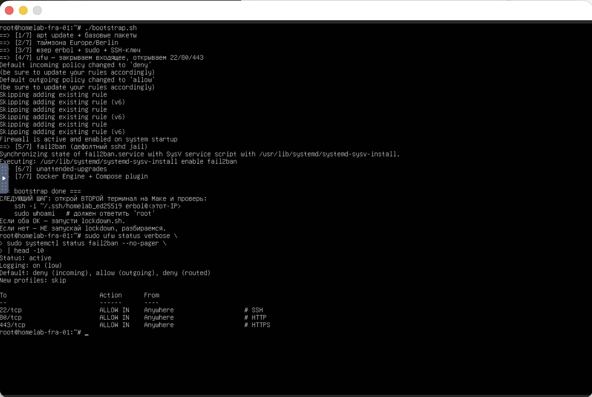
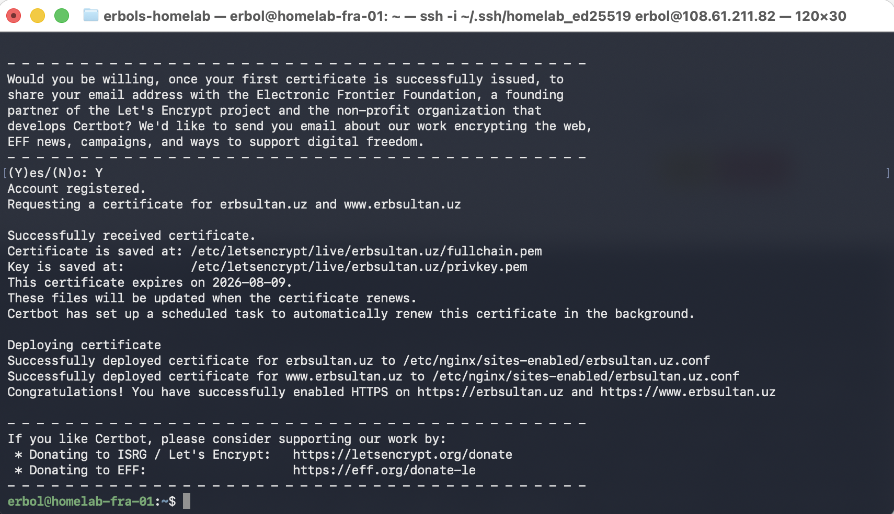

# landing — erbsultan.uz

[](https://github.com/erbsultan/erbols-homelab/actions/workflows/deploy-landing.yml)

✨ Парадный вход homelab: маленький статический personal site, который
живёт на захардненной Ubuntu VPS и открывается на
[`erbsultan.uz`](https://erbsultan.uz).

Сейчас это уже не пустая заглушка, а лёгкая DevOps-профильная страница:
EN/RU, переключатель темы, звёздный фон в dark mode, фото, проекты и
контакты. Первая версия была нарочно минимальной; live-сайт уже вырос в
персональную homepage на `erbsultan.uz`.

<p>
  
</p>

<p>
  <sub>Ранний скриншот первого деплоя. Live-страница теперь выглядит как персональный профиль, описанный выше.</sub>
</p>

> English version: [README.md](./README.md) · Воспроизвести с нуля: [PROVISION_rus.md](./PROVISION_rus.md)

## Статус

| Слой | Инструмент | Состояние |
|------|------------|-----------|
| 🌐 Сайт | Static HTML/CSS/JS | ✅ Personal DevOps profile на `https://erbsultan.uz` |
| 🌓 UI | EN/RU, theme toggle, starfield | ✅ Текущая live-версия |
| 🔐 TLS | Let's Encrypt | ✅ HTTPS включён, auto-renew через systemd |
| 🧱 Web server | nginx | ✅ Статика + редирект HTTP на HTTPS |
| 🛡️ Hardening | ufw, fail2ban, SSH only by key | ✅ root SSH и password auth отключены |
| 🚀 Deploy | GitHub Actions + rsync | ✅ Push в `main` деплоит `landing/site/**` |
| 📬 Deploy notifications | GitHub Actions + Telegram | ✅ Отправляет результат деплоя в Telegram |
| 📊 Observability | Grafana, Prometheus, Loki, Alloy | ✅ Вынесено в [`../observability`](../observability) |

## Архитектура



## Что Уже Работает

- ✅ `erbsultan.uz` резолвится через DNS в eskiz.uz
- ✅ nginx отдаёт статический сайт по HTTPS
- ✅ HTTP редиректит на HTTPS
- ✅ SSH только по ключу; root SSH и password auth отключены
- ✅ `ufw` открывает только SSH, HTTP и HTTPS
- ✅ `fail2ban` следит за SSH
- ✅ GitHub Actions деплоит изменения сайта автоматически
- ✅ GitHub Actions отправляет статус деплоя в Telegram
- ✅ Grafana уже смотрит за метриками VPS и nginx-логами

## Скриншоты

<p>
  
  
</p>

<p>
  
  
</p>

<p>
  <sub>VPS, DNS, firewall hardening и TLS: скучные детали, из-за которых маленькая страница становится настоящим сервисом.</sub>
</p>

## Стек

| Часть | Выбор |
|-------|-------|
| VPS | Vultr Cloud Compute, Frankfurt, `homelab-fra-01` |
| OS | Ubuntu 24.04 LTS |
| Web server | nginx 1.24 |
| TLS | Let's Encrypt через `certbot --nginx` |
| DNS | eskiz.uz для `erbsultan.uz` |
| Fallback DNS | Duck DNS на `erbsultan.duckdns.org` |
| Firewall | `ufw` |
| SSH protection | `fail2ban`, вход только по ключу |
| Deploy | GitHub Actions + `rsync` |

## Полезные Проверки

```bash
curl -I https://erbsultan.uz
sudo nginx -t
sudo ufw status
sudo fail2ban-client status sshd
sudo systemctl list-timers certbot.timer
```

Deploy workflow:

```text
edit landing/site/*
git push origin main
GitHub Actions -> rsync -> /var/www/erbsultan.uz/html
GitHub Actions -> Telegram deploy status message
```

Для deploy notifications нужны GitHub repository secrets:

```text
TELEGRAM_BOT_TOKEN
TELEGRAM_CHAT_ID
```

## Файлы

```text
landing/
├── site/
│   ├── index.html        # English page
│   ├── ru.html           # Russian page
│   ├── style.css         # общие стили
│   ├── theme.js          # light/dark/system theme toggle
│   ├── stars.js          # звёздный фон в dark theme
│   └── me.jpg            # profile image
├── bootstrap/
│   ├── bootstrap.sh      # первичная настройка Ubuntu VPS
│   └── lockdown.sh       # отключает root SSH и password auth
├── nginx/
│   └── erbsultan.uz.conf # HTTP server block до правок certbot
├── docs/img/             # скриншоты
├── PROVISION_rus.md      # точные шаги воспроизведения
└── README_rus.md
```

## Журнал Сборки

| Шаг | Результат |
|-----|-----------|
| VPS | ✅ Vultr Frankfurt instance создан с SSH-ключом |
| Bootstrap | ✅ non-root sudo user, Docker, ufw, fail2ban, unattended upgrades |
| Lockdown | ✅ root SSH и password auth отключены |
| DNS | ✅ `erbsultan.uz -> 108.61.211.82` |
| nginx | ✅ static site из `/var/www/erbsultan.uz/html` |
| TLS | ✅ Let's Encrypt certificate выпущен |
| CI/CD | ✅ GitHub Actions деплоит `landing/site/**` |
| Notifications | ✅ GitHub Actions отправляет статус деплоя в Telegram |
| Monitoring | ✅ вынесен в отдельный проект `observability/` |

## Дальше

- 🧭 Держать landing page минимальной и быстрой
- 🧪 Добавить маленький smoke test для live URL
- 🔐 Позже: прятать внутренние homelab-сервисы за VPN, а не за публичный DNS

Точные команды для воспроизведения на свежей VPS — в [PROVISION_rus.md](./PROVISION_rus.md).
