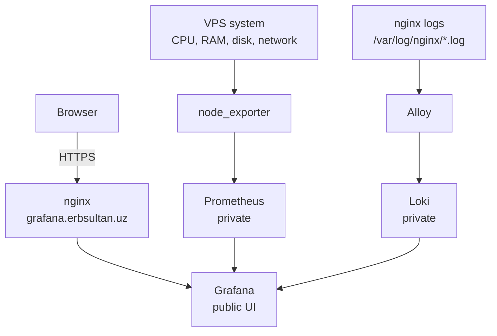

# observability

✨ Monitoring and log collection for the homelab.

This project watches the Vultr VPS that serves
[`erbsultan.uz`](https://erbsultan.uz) and exposes one public UI:
[`grafana.erbsultan.uz`](https://grafana.erbsultan.uz).

> Russian version: [README_rus.md](./README_rus.md)

## Status

| Layer | Tool | State |
|-------|------|-------|
| 📊 Metrics UI | Grafana | ✅ Live on `https://grafana.erbsultan.uz` |
| 📈 Metrics store | Prometheus | ✅ Private on `127.0.0.1:9090` |
| 🖥️ VPS metrics | node_exporter | ✅ Scraped by Prometheus |
| 🪵 Logs store | Loki | ✅ Private on `127.0.0.1:3100` |
| 🚚 Logs shipper | Alloy | ✅ Tails nginx logs |
| 🚨 Alerts | Grafana Alerting + Telegram | ✅ Provisioned from files |
| 🚀 Config sync | GitHub Actions + rsync | ✅ Push to `main` syncs `observability/**` |
| 🧪 Smoke checks | GitHub Actions + Telegram | ✅ Checks public URLs every 30 minutes |
| 🔐 Public access | nginx + Let's Encrypt | ✅ HTTPS enabled |

## Architecture



## What Works

- ✅ Grafana opens over HTTPS at `grafana.erbsultan.uz`
- ✅ Prometheus scrapes itself and `node_exporter`
- ✅ `Node Exporter Full` dashboard is imported from dashboard ID `1860`
- ✅ Loki is connected as a Grafana data source
- ✅ Grafana Explore returns nginx logs with `{job="nginx"}`
- ✅ Grafana Alerting provisions Telegram notifications and basic VPS alerts
- ✅ GitHub Actions syncs observability config changes and reports status to Telegram
- ✅ GitHub Actions checks public endpoints and reports failures to Telegram
- ✅ Prometheus, Loki, and Alloy UI stay private on localhost

## Alerts

Grafana provisions alerting from `grafana/provisioning/alerting`.

Current rules:

- `VPS node_exporter is down` — fires if Prometheus cannot scrape `node_exporter`
- `VPS root disk usage is high` — fires when `/` stays above 85% for 10 minutes
- `VPS load average is high` — fires when load stays above 1.5 per CPU for 10 minutes

Telegram secrets live only in the real VPS `.env`:

```env
TELEGRAM_BOT_TOKEN=123456789:replace-me
TELEGRAM_CHAT_ID=123456789
```

Apply or update alerting:

From your local repo:

```bash
rsync -avz --delete --exclude '.env' \
  -e "ssh -i ~/.ssh/homelab_ed25519" \
  observability/ \
  erbol@108.61.211.82:/opt/erbols-homelab/observability/
```

Then on the VPS:

```bash
cd /opt/erbols-homelab/observability
docker compose up -d
docker compose restart grafana
```

Then open Grafana and test the contact point:

```text
Alerts & IRM -> Alerting -> Notification configuration -> Contact points -> telegram-homelab -> Test
```

Provisioned alerting resources are managed from files. Grafana shows them in
the UI, but edits should be made in git and applied by restarting Grafana.

Telegram notifications use a custom message template in
`grafana/provisioning/alerting/contact-points.yml`.

## Config Sync

Pushes to `main` that touch `observability/**` run
`.github/workflows/deploy-observability.yml`.

The workflow syncs this directory to the VPS while preserving the real `.env`:

```text
observability/ -> /opt/erbols-homelab/observability/
```

It also sends the sync result to Telegram. GitHub repository secrets required:

```text
SSH_PRIVATE_KEY
SSH_KNOWN_HOSTS
TELEGRAM_BOT_TOKEN
TELEGRAM_CHAT_ID
```

After config sync, apply runtime changes on the VPS:

```bash
cd /opt/erbols-homelab/observability
docker compose up -d
```

For Grafana provisioning changes, recreate Grafana:

```bash
docker compose up -d --force-recreate grafana
```

## Smoke Checks

`.github/workflows/smoke-checks.yml` checks public endpoints every 30 minutes:

- `https://erbsultan.uz`
- `https://grafana.erbsultan.uz`

Scheduled runs send Telegram only on failure. Manual runs send Telegram for
both success and failure, which is useful for testing the workflow.

GitHub repository secrets required:

```text
TELEGRAM_BOT_TOKEN
TELEGRAM_CHAT_ID
```

## Screenshots

<p>
  
  
</p>

<p>
  <sub>Left: live VPS metrics from node_exporter. Right: nginx logs flowing through Alloy into Loki.</sub>
</p>

## Components

| Component | Purpose | Address |
|-----------|---------|---------|
| Grafana | Dashboards and Explore UI | `https://grafana.erbsultan.uz` |
| Prometheus | Metrics storage and queries | `http://127.0.0.1:9090` |
| node_exporter | VPS system metrics | Docker network only |
| Loki | Log storage and LogQL queries | `http://127.0.0.1:3100` |
| Alloy | Reads nginx logs and sends them to Loki | `http://127.0.0.1:12345` |

## Useful Checks

```bash
docker ps
curl http://127.0.0.1:9090/-/ready
curl http://127.0.0.1:3100/ready
curl -I http://127.0.0.1:12345
```

Prometheus targets:

```bash
curl -s http://127.0.0.1:9090/api/v1/targets \
  | jq '.data.activeTargets[] | {job: .labels.job, health: .health, scrapeUrl: .scrapeUrl}'
```

Loki query in Grafana Explore:

```logql
{job="nginx"}
```

## Files

```text
observability/
├── compose.yml                       # Grafana, Prometheus, node_exporter, Loki, Alloy
├── .env.example                      # example Grafana admin variables
├── grafana/
│   └── provisioning/
│       ├── datasources/              # Prometheus and Loki data sources
│       └── alerting/                 # Telegram contact point, policy, alert rules
├── prometheus/
│   └── prometheus.yml                # scrape config
├── loki/
│   └── loki-config.yaml              # single-node Loki config
├── alloy/
│   └── config.alloy                  # nginx log collection
└── nginx/
    └── grafana.erbsultan.uz.conf     # reverse proxy before certbot edits
```

The real `.env` lives only on the VPS:

```text
/opt/erbols-homelab/observability/.env
```

It is intentionally not committed.

## Security Posture

Grafana is the only public observability entrypoint. Everything else is
bound to localhost or kept inside the Docker network.

| Service | Public? | Why |
|---------|---------|-----|
| Grafana | ✅ Yes | Human-facing dashboard UI |
| Prometheus | ❌ No | Internal metrics API |
| Loki | ❌ No | Internal logs API |
| Alloy UI | ❌ No | Local debugging only |
| node_exporter | ❌ No | Internal scrape target |

## Build Log

| Step | Result |
|------|--------|
| DNS | ✅ `grafana.erbsultan.uz -> 108.61.211.82` |
| VPS baseline | ✅ `homelab-fra-01`, nginx OK, Docker ready |
| Grafana | ✅ container running behind nginx + HTTPS |
| Prometheus | ✅ targets `prometheus` and `node` are `up` |
| Dashboard | ✅ `Node Exporter Full` imported |
| Loki | ✅ returns `ready` |
| Alloy | ✅ tails `/var/log/nginx/*.log` |
| Logs | ✅ `{job="nginx"}` returns nginx entries |
| Alerts | ✅ Telegram contact point and basic VPS rules are provisioned |
| Config sync | ✅ GitHub Actions syncs `observability/**` and sends Telegram status |
| Smoke checks | ✅ public URLs are checked from GitHub Actions every 30 minutes |

## Next

- 🧭 Add an nginx access-log dashboard
- 📬 Optionally add email as a second alert contact point
- 🔐 Later: move Grafana behind OpenVPN when the VPN project exists
