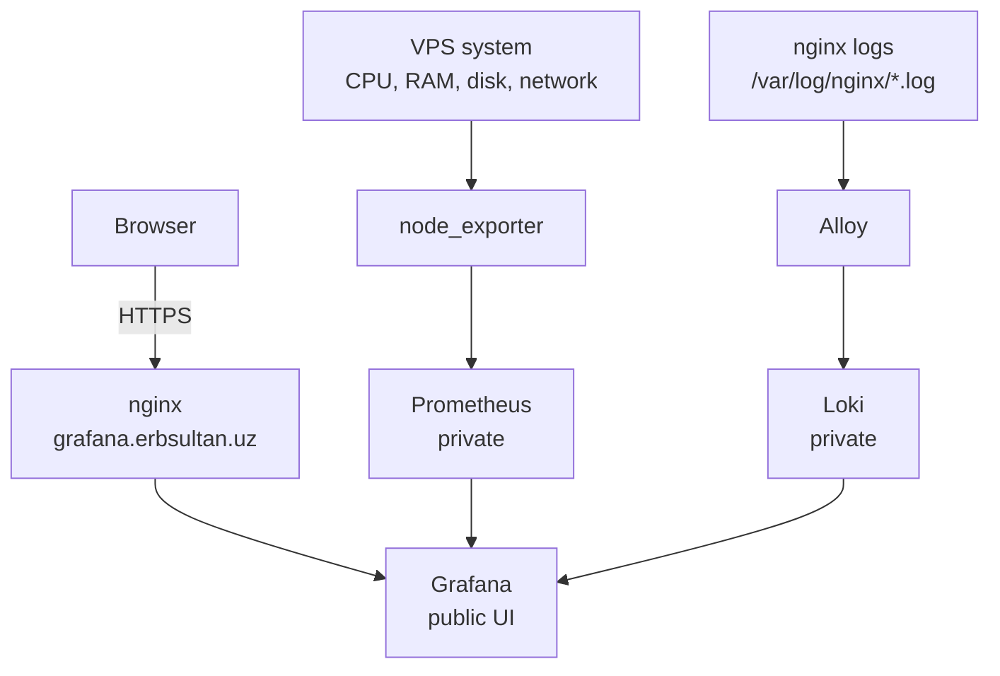

# observability

✨ Мониторинг и сбор логов для homelab.

Этот проект наблюдает за Vultr VPS, на котором работает
[`erbsultan.uz`](https://erbsultan.uz), и даёт один публичный интерфейс:
[`grafana.erbsultan.uz`](https://grafana.erbsultan.uz).

> English version: [README.md](./README.md)

## Статус

| Слой | Инструмент | Состояние |
|------|------------|-----------|
| 📊 UI метрик | Grafana | ✅ Живёт на `https://grafana.erbsultan.uz` |
| 📈 Хранилище метрик | Prometheus | ✅ Приватно на `127.0.0.1:9090` |
| 🖥️ Метрики VPS | node_exporter | ✅ Scrape через Prometheus |
| 🪵 Хранилище логов | Loki | ✅ Приватно на `127.0.0.1:3100` |
| 🚚 Доставка логов | Alloy | ✅ Читает nginx-логи |
| 🔐 Публичный доступ | nginx + Let's Encrypt | ✅ HTTPS включён |

## Архитектура



## Что Уже Работает

- ✅ Grafana открывается по HTTPS на `grafana.erbsultan.uz`
- ✅ Prometheus собирает метрики с себя и `node_exporter`
- ✅ Импортирован dashboard `Node Exporter Full` по ID `1860`
- ✅ Loki подключён как Grafana data source
- ✅ В Grafana Explore запрос `{job="nginx"}` возвращает nginx-логи
- ✅ Prometheus, Loki и Alloy UI не торчат наружу

## Скриншоты

<p>
  
  
</p>

<p>
  <sub>Слева: живые VPS-метрики из node_exporter. Справа: nginx-логи через Alloy в Loki.</sub>
</p>

## Компоненты

| Компонент | Зачем нужен | Адрес |
|-----------|-------------|-------|
| Grafana | Dashboards и Explore UI | `https://grafana.erbsultan.uz` |
| Prometheus | Хранит и отдаёт метрики | `http://127.0.0.1:9090` |
| node_exporter | Системные метрики VPS | Только Docker network |
| Loki | Хранит логи и отвечает на LogQL | `http://127.0.0.1:3100` |
| Alloy | Читает nginx-логи и отправляет их в Loki | `http://127.0.0.1:12345` |

## Полезные Проверки

```bash
docker ps
curl http://127.0.0.1:9090/-/ready
curl http://127.0.0.1:3100/ready
curl -I http://127.0.0.1:12345
```

Prometheus targets:

```bash
curl -s http://127.0.0.1:9090/api/v1/targets \
  | jq '.data.activeTargets[] | {job: .labels.job, health: .health, scrapeUrl: .scrapeUrl}'
```

Loki query в Grafana Explore:

```logql
{job="nginx"}
```

## Файлы

```text
observability/
├── compose.yml                       # Grafana, Prometheus, node_exporter, Loki, Alloy
├── .env.example                      # пример Grafana admin variables
├── prometheus/
│   └── prometheus.yml                # scrape config
├── loki/
│   └── loki-config.yaml              # single-node Loki config
├── alloy/
│   └── config.alloy                  # сбор nginx-логов
└── nginx/
    └── grafana.erbsultan.uz.conf     # reverse proxy до правок certbot
```

Настоящий `.env` лежит только на VPS:

```text
/opt/erbols-homelab/observability/.env
```

Он специально не коммитится.

## Безопасность

Grafana — единственная публичная точка входа в observability. Всё остальное
привязано к localhost или живёт только внутри Docker network.

| Service | Публичный? | Почему |
|---------|------------|--------|
| Grafana | ✅ Да | Интерфейс для человека |
| Prometheus | ❌ Нет | Внутренний metrics API |
| Loki | ❌ Нет | Внутренний logs API |
| Alloy UI | ❌ Нет | Только локальная отладка |
| node_exporter | ❌ Нет | Только scrape target |

## Журнал Сборки

| Шаг | Результат |
|-----|-----------|
| DNS | ✅ `grafana.erbsultan.uz -> 108.61.211.82` |
| VPS baseline | ✅ `homelab-fra-01`, nginx OK, Docker ready |
| Grafana | ✅ container работает за nginx + HTTPS |
| Prometheus | ✅ targets `prometheus` и `node` в состоянии `up` |
| Dashboard | ✅ `Node Exporter Full` импортирован |
| Loki | ✅ возвращает `ready` |
| Alloy | ✅ читает `/var/log/nginx/*.log` |
| Logs | ✅ `{job="nginx"}` возвращает nginx entries |

## Дальше

- 🚨 Добавить Grafana alerts для диска, load average и down-сервисов
- 📬 Отправлять alerts в Telegram или email
- 🧭 Сделать отдельный dashboard по nginx access logs
- 🔐 Позже: спрятать Grafana за OpenVPN, когда появится VPN-проект
