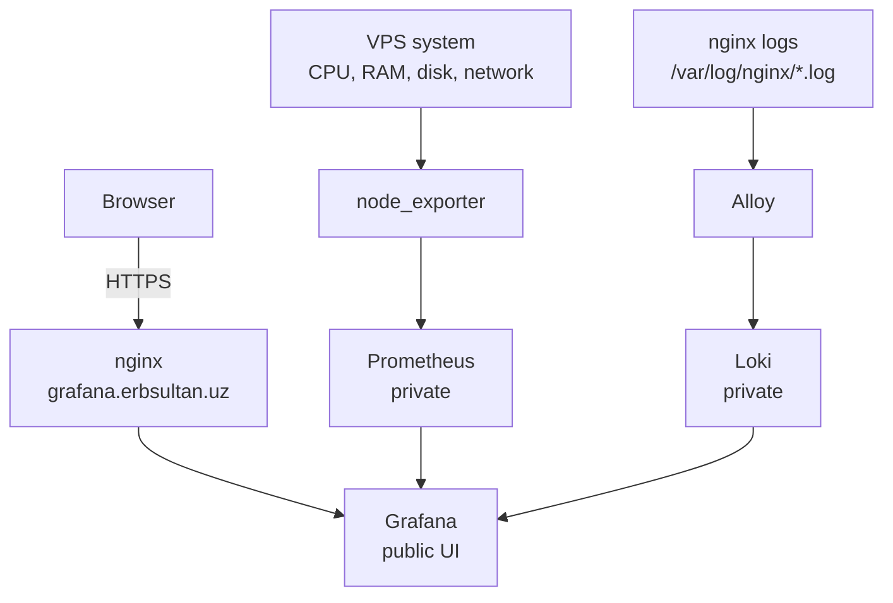
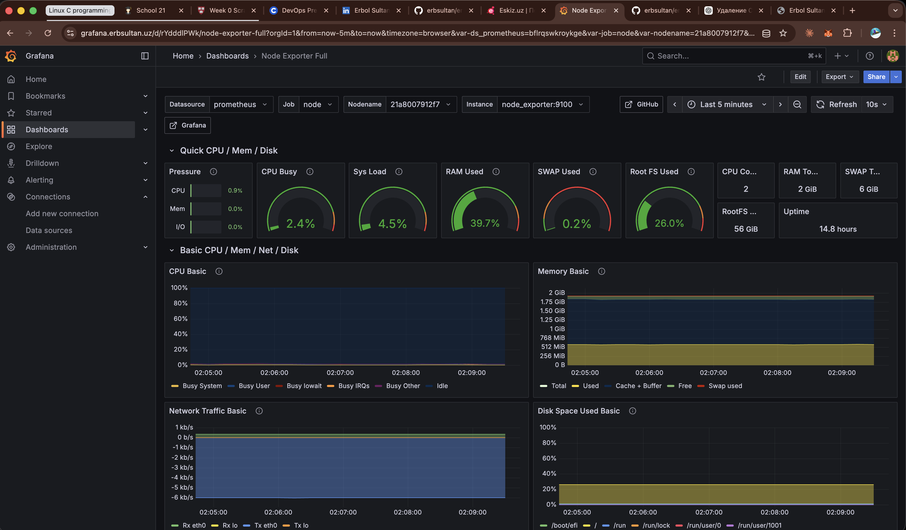
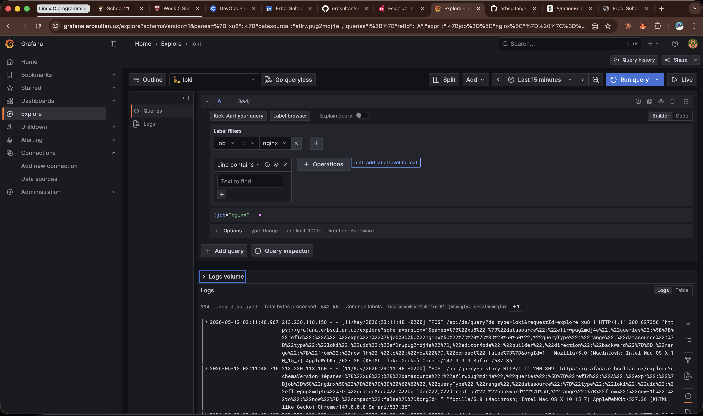

# observability

✨ Мониторинг и сбор логов для homelab.

Этот проект наблюдает за Vultr VPS, на котором работает
[`erbsultan.uz`](https://erbsultan.uz), и даёт один публичный интерфейс:
[`grafana.erbsultan.uz`](https://grafana.erbsultan.uz).

> English version: [README.md](./README.md)

## Статус

| Слой | Инструмент | Состояние |
|------|------------|-----------|
| 📊 UI метрик | Grafana | ✅ Живёт на `https://grafana.erbsultan.uz` |
| 📈 Хранилище метрик | Prometheus | ✅ Приватно на `127.0.0.1:9090` |
| 🖥️ Метрики VPS | node_exporter | ✅ Scrape через Prometheus |
| 🪵 Хранилище логов | Loki | ✅ Приватно на `127.0.0.1:3100` |
| 🚚 Доставка логов | Alloy | ✅ Читает nginx-логи |
| 🚨 Alerts | Grafana Alerting + Telegram | ✅ Provisioning из файлов |
| 🚀 Config sync | GitHub Actions + rsync | ✅ Push в `main` синхронизирует `observability/**` |
| 🔐 Публичный доступ | nginx + Let's Encrypt | ✅ HTTPS включён |

## Архитектура



## Что Уже Работает

- ✅ Grafana открывается по HTTPS на `grafana.erbsultan.uz`
- ✅ Prometheus собирает метрики с себя и `node_exporter`
- ✅ Импортирован dashboard `Node Exporter Full` по ID `1860`
- ✅ Loki подключён как Grafana data source
- ✅ В Grafana Explore запрос `{job="nginx"}` возвращает nginx-логи
- ✅ Grafana Alerting настраивает Telegram-уведомления и базовые VPS alerts
- ✅ GitHub Actions синхронизирует observability config и отправляет статус в Telegram
- ✅ Prometheus, Loki и Alloy UI не торчат наружу

## Alerts

Grafana берёт alerting-конфигурацию из `grafana/provisioning/alerting`.

Текущие правила:

- `VPS node_exporter is down` — срабатывает, если Prometheus не может scrape `node_exporter`
- `VPS root disk usage is high` — срабатывает, если `/` держится выше 85% 10 минут
- `VPS load average is high` — срабатывает, если load держится выше 1.5 на CPU 10 минут

Telegram-секреты лежат только в настоящем `.env` на VPS:

```env
TELEGRAM_BOT_TOKEN=123456789:replace-me
TELEGRAM_CHAT_ID=123456789
```

Применить или обновить alerts:

Из локального репозитория:

```bash
rsync -avz --delete --exclude '.env' \
  -e "ssh -i ~/.ssh/homelab_ed25519" \
  observability/ \
  erbol@108.61.211.82:/opt/erbols-homelab/observability/
```

Потом на VPS:

```bash
cd /opt/erbols-homelab/observability
docker compose up -d
docker compose restart grafana
```

Потом в Grafana можно проверить отправку:

```text
Alerts & IRM -> Alerting -> Notification configuration -> Contact points -> telegram-homelab -> Test
```

Provisioned alerting resources управляются из файлов. Grafana показывает их
в UI, но править их лучше в git и применять рестартом Grafana.

Telegram-уведомления используют custom message template в
`grafana/provisioning/alerting/contact-points.yml`.

## Config Sync

Push в `main`, который затрагивает `observability/**`, запускает
`.github/workflows/deploy-observability.yml`.

Workflow синхронизирует эту директорию на VPS и сохраняет настоящий `.env`:

```text
observability/ -> /opt/erbols-homelab/observability/
```

Он также отправляет результат sync в Telegram. Нужные GitHub repository secrets:

```text
SSH_PRIVATE_KEY
SSH_KNOWN_HOSTS
TELEGRAM_BOT_TOKEN
TELEGRAM_CHAT_ID
```

После config sync применить runtime-изменения на VPS:

```bash
cd /opt/erbols-homelab/observability
docker compose up -d
```

Для изменений Grafana provisioning пересоздать Grafana:

```bash
docker compose up -d --force-recreate grafana
```

## Скриншоты

<p>
  
  
</p>

<p>
  <sub>Слева: живые VPS-метрики из node_exporter. Справа: nginx-логи через Alloy в Loki.</sub>
</p>

## Компоненты

| Компонент | Зачем нужен | Адрес |
|-----------|-------------|-------|
| Grafana | Dashboards и Explore UI | `https://grafana.erbsultan.uz` |
| Prometheus | Хранит и отдаёт метрики | `http://127.0.0.1:9090` |
| node_exporter | Системные метрики VPS | Только Docker network |
| Loki | Хранит логи и отвечает на LogQL | `http://127.0.0.1:3100` |
| Alloy | Читает nginx-логи и отправляет их в Loki | `http://127.0.0.1:12345` |

## Полезные Проверки

```bash
docker ps
curl http://127.0.0.1:9090/-/ready
curl http://127.0.0.1:3100/ready
curl -I http://127.0.0.1:12345
```

Prometheus targets:

```bash
curl -s http://127.0.0.1:9090/api/v1/targets \
  | jq '.data.activeTargets[] | {job: .labels.job, health: .health, scrapeUrl: .scrapeUrl}'
```

Loki query в Grafana Explore:

```logql
{job="nginx"}
```

## Файлы

```text
observability/
├── compose.yml                       # Grafana, Prometheus, node_exporter, Loki, Alloy
├── .env.example                      # пример Grafana admin variables
├── grafana/
│   └── provisioning/
│       ├── datasources/              # Prometheus и Loki data sources
│       └── alerting/                 # Telegram contact point, policy, alert rules
├── prometheus/
│   └── prometheus.yml                # scrape config
├── loki/
│   └── loki-config.yaml              # single-node Loki config
├── alloy/
│   └── config.alloy                  # сбор nginx-логов
└── nginx/
    └── grafana.erbsultan.uz.conf     # reverse proxy до правок certbot
```

Настоящий `.env` лежит только на VPS:

```text
/opt/erbols-homelab/observability/.env
```

Он специально не коммитится.

## Безопасность

Grafana — единственная публичная точка входа в observability. Всё остальное
привязано к localhost или живёт только внутри Docker network.

| Service | Публичный? | Почему |
|---------|------------|--------|
| Grafana | ✅ Да | Интерфейс для человека |
| Prometheus | ❌ Нет | Внутренний metrics API |
| Loki | ❌ Нет | Внутренний logs API |
| Alloy UI | ❌ Нет | Только локальная отладка |
| node_exporter | ❌ Нет | Только scrape target |

## Журнал Сборки

| Шаг | Результат |
|-----|-----------|
| DNS | ✅ `grafana.erbsultan.uz -> 108.61.211.82` |
| VPS baseline | ✅ `homelab-fra-01`, nginx OK, Docker ready |
| Grafana | ✅ container работает за nginx + HTTPS |
| Prometheus | ✅ targets `prometheus` и `node` в состоянии `up` |
| Dashboard | ✅ `Node Exporter Full` импортирован |
| Loki | ✅ возвращает `ready` |
| Alloy | ✅ читает `/var/log/nginx/*.log` |
| Logs | ✅ `{job="nginx"}` возвращает nginx entries |
| Alerts | ✅ Telegram contact point и базовые VPS rules provisioned |
| Config sync | ✅ GitHub Actions синхронизирует `observability/**` и отправляет Telegram status |

## Дальше

- 🧭 Сделать отдельный dashboard по nginx access logs
- 📬 При желании добавить email вторым alert contact point
- 🔐 Позже: спрятать Grafana за OpenVPN, когда появится VPN-проект
